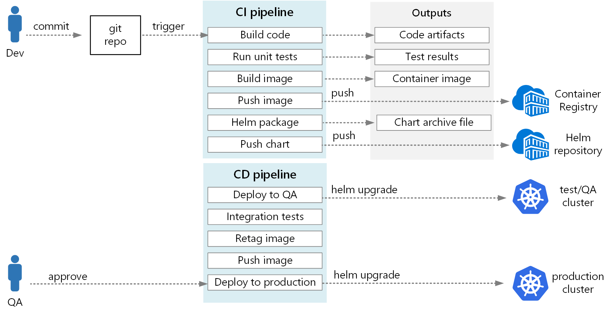

# Set up 
## CI/CD Flow


## Cud-api
```
cd <project root>
docker image ls 
docker image rm cud-api:0.1 # if exists
mvn clean install
docker build -t cud-api:0.1 ./cud-api/

docker run -p 9100:9100 -e POSTGRES_URL=jdbc:postgresql://192.168.1.10:5432/postgres -e POSTGRES_USER=postgres -e POSTGRES_PASSWORD=password --name cud-api --network=avis_network -it cud-api:0.1
```
### Run test environment
```
docker compose -f cud-api-test/src/test/resources/docker-compose.yaml up
docker compose -f cud-api-test/src/test/resources/docker-compose.yaml down
```

## Development Environment
### Start kafka, zookeeper, postgres, pgadmin
```
docker compose up
```
To check kafka - go to bin folder of kafka installation
```
./kafka-topics.sh --bootstrap-server localhost:19092 --list
```
To check postgres and pgadmin Go to http://localhost:5050/
* **User :** admin@admin.com
* **Password :** root

## GraphQL 
* http://localhost:8080/graphiql
* http://localhost:8080/voyager
